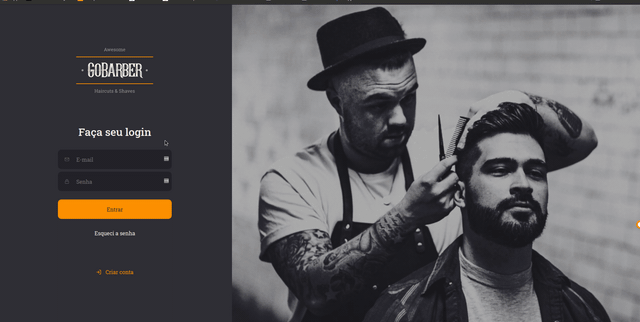

# Gobarber Web

Acessar demo aqui: [Demo](https://gobarber-webb.netlify.app/)

# Tecnologias
- HTML
- CSS
- Animações
- Javascript.
- Typescript
- React.
- React Router.
- React Context API.
- React Router.
- Styled Components.

# Como executar esse projeto.

1º Clone esse repositório:

`git clone https://github.com/apteles/gobarber-web`

2º Entre na pasta gobarber-web:

`cd gobarber-web`

2º Instale as dependências do projeto:

`yarn install`

3º Agora execute o comando para iniciar:

`yarn start`

## Licença

